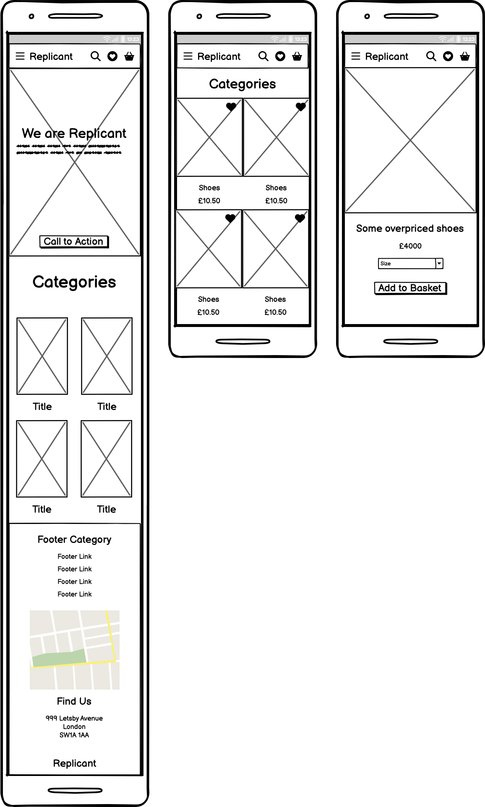

# Replicant

## Overview

### Purpose
Replicant is an E-Commerce site for a clothing/ apparel brand aimed at bringing a boutique fashion collection lead by a futuristic/cyberpunk aesthtic mixed with vintage sensibilities inspired as the name suggests by films like "Bladerunner" and to a lesser extent "A Clockwork Orange".
The idea is that grounding futurism with classical elements makes it both much more wearable and able to stand the test of time whilst still having the wow factor and edge of presenting something new to our audience and our customers. The site itself channels style and design conccepts from high end brands like Gucci; going for a minimalist chic with large clean hero image show off our products and make it easy and clear where the customer need to navigate to make their purchase and locate their interests.

### Target Audience
The target audience is anyone interested in fashion clothing and new looks.

## User Stories

### Must-Have User Stories:

1. #####Customer Registration 

As a Customer I can **register an account** so that I can **make a purchase and use other registered only features of the site**

##### Acceptance Criteria
On giving an email I can register an account
##### Tasks
Implement registration form

2. ##### Login/Log-out

 As a Customer I can **Login and Log-out of the site and see my login status** so that I can **access my personal information and order history and know what account is using the site**

##### Acceptance Criteria
The Login/Logout screen is in place.
There is a statement in the header that shows weather a user is logged in and if so which user.
##### Tasks
Create/alter the form for the Login/Logout in forms.py
Create Login/Logout html

3. ##### Navbar 

As a customer I can **use a navbar** so that I can **easily navigate between all pages/features of the site**

##### Acceptance Criteria
A navbar is in place on all relevant pages
The navbar is responsive to different screen-sizes
##### Tasks
Code navbar in base.html
add bootstrap or other responsiveness using a burger icon etc

### Should-Have User Stories
- **User Story 1:** Briefly describe the should-have feature.  
  **Acceptance Criteria:** List the criteria that define the successful implementation of this user story.
- **User Story 2:** Briefly describe the should-have feature.  
  **Acceptance Criteria:** List the criteria that define the successful implementation of this user story.

4. ##### Home Page

As a customer I can **see a clean easy to navigate homepage when I load the sites URL** so that I can **easily take in and move between the sites features leading to a fun shopping experience**

##### Acceptance Criteria
The homepage loads and looks good
-The eye is drawn in a logical fashion around the home page
##### Tasks
Home page HTML in place
Home page Styling via CSS in place
Possibility of some Javascript for modals or Hero-image interactivity/ movement

5. ##### Product range/Product Pagination

As a customer I can **click a product range icon to see a list of all products in the range and likewise click a product to see a products features** so that I can **easily navigate the stores inventory and take in the details of any product I am interested in**

##### Acceptance Criteria
I can see Paginated Cards for product ranges on the Home page
These lead to a product Range page with a paginated list of products that in turn lead to a product features page for each product
##### Tasks
Create Suitable product range html templates and views
Create Suitable product information templates and views
Style the range and product information pages with CSS
Have a product model in models.py that has all fields needed for the product

6. ##### Admin Manage Products

As an admin **I want to be able to add, update or delete products** so that I can **manage the product catalog**

##### Acceptance Criteria
Acceptance_Criteria_1:The admin should be able to add new products with name, description, price, images, and category.
Acceptance_Criteria_2 :The admin should be able to update product details (e.g., price, description).
Acceptance_Criteria_3 :The admin should be able to remove products from the catalog.
Acceptance_Criteria_3:The admin should be able to view a list of all products
##### Tasks
Create a product management page for admins
Implement form to add new products
Implement functionality to update product details.
Implement functionality to delete products from the catalog.

7. ##### The Cart

As a customer I can **add products I want to buy to a cart** so that I can **checkout and purchase multiple items at the same time**

##### Acceptance Criteria
Product cart visible to customer and has link
Customer can add items to cart on click
##### Tasks
Product Cart has separate page/modal with relevant form/html
Add to Cart button is implemented as part of product detail html
Relevant views and urls updated

### Should-Have User Stories

1. ##### Admin - Manage Orders

As an Admin I can **view and manage all orders** so that I can **ensure timely processing and handle any issues**

##### Acceptance Criteria
Acceptance_Criteria_1 : The admin should be able to view a list of all orders.
Acceptance_Criteria_2 : The admin should be able to filter orders by status (pending, completed)
Acceptance_Criteria_3 :The admin should be able to update the order status (e.g., mark as shipped, complete)
Acceptance_Criteria_4 : The admin should be able to view order details (products, customer, shipping address)
Acceptance_Criteria_5: The admin should be able to refund or cancel orders
##### Tasks
Implement order management page for admins to view and filter orders.
Implement order status management (mark as shipped, completed, etc.).
Enable admins to view order details (products, customer information).
Implement refund and order cancellation functionality.

2. ##### Admin - Manage Inventory

As an Admin I can **manage my product inventory** so that **I can keep track of stock levels, ensure products are available for sale, and update stock when needed.**

##### Acceptance Criteria
Acceptance_Criteria_1: The Admin should be able to view the current inventory levels for each product they have listed
Acceptance_Criteria_2 : The Admin should be able to update the stock quantity for a specific product.
Acceptance_Criteria_3 : The Admin should be able to mark products as out of stock when inventory reaches zero
-Acceptance_Criteria_4 : The inventory management page should display important product details like name, price, current stock, and status (in stock or out of stock).
-Acceptance_Criteria_5 : The system should ensure that customers cannot purchase products that are out of stock.
##### Tasks
Create a page where Admin can view the product inventory.
Add a functionality where Admin can update the stock for individual products.
Provide input fields for adding or subtracting stock numbers.
Ensure that the stock is updated in the database after the Admin submits the changes.
Provide the Admin with an option to mark products as out of stock when inventory hits zero.
Ensure that out-of-stock products are no longer available for customers to purchase .
Show an appropriate out of stock message on the product detail page if the product is unavailable.

3. ##### About Page

As a customer I can **See an About page** so that I can **view information about the business as a whole and its current fashion message/ ethos**

##### Acceptance Criteria
About page is viewable
About page added to navbar and given update functionality
##### Tasks
-Make about page app separately

Make about page html views and update urls
Style about page in CSS
make about page update functionality

### Could-Have User Stories

1. ##### Product Review

As a customer I can **See a product review when looking at product details** so that I can **see what other customers experience and thoughts on this product were**

##### Acceptance Criteria
Product review is visible in product details page
Customers are able to place product reviews when looking at a product
##### Tasks
Product review html added/integrated to product details html
Product review forms.py updated to accept product reviews
Admin capable of handling product review submission

2. ##### Wish List

As a customer I can **add products to a wish list** so that **even if I don't want to buy them now I can easily find them at a later point**

##### Acceptance Criteria
A wishlist page/pop-up is available with a clear button for the customer to look at the items list within
Products have a wishlist button that a customer can register interest with by clicking
##### Tasks
Implement wish list forms/html
Add button for "wish listing" to product detail html
update views and urls as necessary

3. ##### Shipment

As a customer I can **have my order added to a shipment when I make a purchase** so that I can **be made aware when to expect the arrival of my purchased goods and track this process**

##### Acceptance Criteria
Shipment exists and is viewable
Track shipment button implemented
##### Tasks
Make shipment Model
add necessary shipment forms/ html
add shipments button


## Design Decisions

### Wireframes

Here are the basic wire-frames we used to establish the design for the Replicant site:



As can be seen on the Home page we are going for a Hero Image to establish our brand that will sit above a sries of cards for each category of clothing and apparel we intend to sell. The image has a clean header above it that uses responsive features to enable a burger icon to reduce nav-bar space taken on smaller screens. Our wirefram is for a phone/small tablet size device and will faeture the item categoty card in a 2x2 formation that will expand to a 3x2 or possibly even 4x2 formation to show more cards on larger screens. When a customer clicks an item category they are lead into a screen showing of all individual items in that category on cards givien a similar responsiveness to that used on the homepage and in turn when you click the cards for those individual items details will be displayed for those items.

### Accessibility Considerations

We went for a bold colour contrasting theme with black backgrounds lit up by neons that should be the easiest possible to follow for those with visual impairment. We have also used a minimalist look which keeps features clean and easy to follow alongside playing into our futuristic high fashion aesthetic.

## AI Tools Usage

### Chat-GPT

Chat-Gpt was used to generate a lot of our fashion images and particularly those of individual items. To do this I fed it many photos from futuristic movies that we thought had cool styles and aesthetics. Often we asked it to generate shots of individual items from an outfit on plain backgrounds like the ones used on the Category Cards.

## Features Implementation

### Core Features (Must-Haves)

### Logo and navigation bar

A responsive navigation bar is in place. Concentrating on 'mobile first' design, the navigation bar incorporates a clickable burger icon with a drop down menu on mobile. There is a burger icon at tablet size too, but when moving to monitor size the burger disappears and a navigation bar appears with options to navigate to pages; 'Home', 'About' or 'Create' and depending on the user login status also a 'Register' and 'Login' link or a 'Logout'. The nav bar also displays the user login status with the message 'You are not logged in' or 'You are logged in as XXXXX'. In the top left corner there is a clickable project logo that also acts as a 'Home' button. See wireframes and other screenshots to view these features or log in to the project.

### Clear indication as to whether the user is logged in or out at all times

As mentioned above the nav bar displays user login status with the message 'You are not logged in' or 'You are logged in as XXXXX'

### Pagination

This feature forms the list of 2x2 or 3x2 product ranges or products and generates the next and previous buttons dependent on the users position in the content.


### Sign in form

For the security forms at the moment I have django generics but I plan to replace the with crispy forms the moment i get time.

### Register form (Sign up)

For the security forms at the moment I have django generics but I plan to replace the with crispy forms the moment i get time.

### Sign out page

For the security forms at the moment I have django generics but I plan to replace the with crispy forms the moment i get time.


### Advanced Features (Should-Haves)

### Django alert messages

Every time there is a change in data the user is alerted. For example when a review is created, or edited and the same for comments. Also there is a notification when the user logs in or out to confirm their action. These appear in the blank space in the middle of the navigation bar to be in the users eyeline when possible.


### Optional Features (Could-Haves)


## Testing and Validation

### Testing Results
Summarize the results of testing across different devices and screen sizes.  
Mention any issues found and how they were resolved.  
**Guidance:** Summarize the results of your testing across various devices using tools like Chrome DevTools, as outlined in Phase 2. Mention any issues found and how they were resolved.

### Validation
Discuss the validation process for HTML and CSS using W3C and Jigsaw validators.  
Include the results of the validation process.  
**Guidance:** Document your use of W3C and Jigsaw validators to ensure your HTML and CSS meet web standards. Include any errors or warnings encountered and how they were resolved.

## Technology used

### Languages and framework

- [HTML5](https://developer.mozilla.org/en-US/docs/Learn/HTML "link to html mozilla documentation")
  was used to create content and structure
- [CSS](https://developer.mozilla.org/en-US/docs/Learn/CSS "link to css mozilla documentation")
  was used to add custom styles
- [JavaScript](https://developer.mozilla.org/en-US/docs/Web/javascript "link to javascript mozilla documentation") was used to dynamically reset the comment form if the reset button was clicked and to show a modal when the edit comment button was clicked
- [Django](https://www.djangoproject.com/ "link to django docs homepage") was the python framework used to develop the site

### Database

- [PostgreSQL from Code Institute](https://dbs.ci-dbs.net/ "link to postgresql from code institute") was used as the PostgreSQL database for this project

### Technologies and tools

- [Gitpod](https://www.gitpod.io/ "link to gitpod website") was used as the ide for this whole project
- [Cloudinary](https://cloudinary.com/ "link to cloudinary homepage") was used to host images
- [GitHub](https://github.com/ "link to github webpage") was used to store the code files, README files and assets
- [Git](https://git-scm.com/ "link to official git website") was used as a version control software to commit and push the code to the GitHub repository
- [Heroku](https://id.heroku.com/login "link to Heroku login") was used to deploy the project
- [lucid chart](https://https://www.lucidchart.com/pages/er-diagrams/ "limk to lucidchart website") was used to make a diagram of the database schema.
- [Bootstrap](https://getbootstrap.com/ "link to official bootstrap website") was used to quickly layout, position and size critical website features
- [Balsamiq](https://balsamiq.com/wireframes/ "link to official balsamiq website") was used in early planning to map out wireframes
- [Google Fonts](https://fonts.google.com/ "link to official google fonts website") was used to import fonts
- [Favicon Generator](https://favicon.io/favicon-generator/ "link to official favicon generator website") was used to make an 'S' shaped favicon
- [Font Awesome](https://fontawesome.com/ "link to official font awesome website") was used for all icons
- [Google Chrome Developer Tools](https://developer.chrome.com/docs/devtools/overview/ "Link to official chrome developer tools website") was used for lighthouse testing, debugging and consistently checking responsiveness
- [W3C Markup Validator](https://validator.w3.org/ "link to official html validator") was used to validate all live html
- [Jigsaw CSS Validator](https://jigsaw.w3.org/css-validator/ "link to official css validator") was used to validate CSS code
- [JS Hint](https://jshint.com/ "link to official javascript validator") was used to validate JavaScript code
- [Code Institute Python Linter](https://pep8ci.herokuapp.com/ "link to official python validator") was used to validate all python code
- [Django Summernote](https://pypi.org/project/django-summernote/ "link to official summernote website") was used. This is a rich text editor plugin for Django
- [Chat-GPT](https://chat.openai.com/ "link to chat gpt") was used to create the fashion images and product content.

### GitHub Copilot
Brief reflection on the effectiveness of using AI tools for debugging and validation.  
**Guidance:** Reflect on how GitHub Copilot assisted with debugging and validation, particularly any issues it helped resolve.

## Deployment

All code for this project was written in Gitpod as the integrated development environment. GitHub was used for version control, and the application was deployed to Heroku from GitHub.

### Pre deployment

To ensure a successful deployment to Heroku, the following practices are to be followed (Experience from previous Django projects):

- **Requirements File:** The `requirements.txt` file must be kept up to date to ensure all imported Python modules are configured correctly for Heroku.
- **Procfile:** A `Procfile` was added to configure the application as a Gunicorn web app on Heroku.
- **Allowed Hosts:** In `settings.py`, the `ALLOWED_HOSTS` list was configured to include the Heroku app name and `localhost`. Example format:
    ```python
    ALLOWED_HOSTS = ['your-app-name.herokuapp.com', 'localhost']
    ```
- **Environment Variables:** All sensitive data such as the `DATABASE_URL`, `CLOUDINARY_URL`, and `SECRET_KEY` were added to the `.env` file, which is ignored by Git using `.gitignore`. These variables are added to Heroku manually through the Config Vars section.

### Deploying with heroku

The steps for deploying to Heroku are as follows (Experience from previous Django projects):

1. **Create New App:** Log in to your Heroku account and click on the "Create New App" button.
2. **App Name:** Choose a unique name for your app.
3. **Select Region:** Choose the appropriate region (Europe was selected for this project).
4. **Create App:** Click the "Create App" button to proceed.
5. **Deployment Method:** In the "Deploy" tab, select GitHub as the deployment method.
6. **Connect to GitHub:** Search for the repository name and click "Connect".
7. **Manual or Automatic Deployment:** Select either manual or automatic deployment. Ensure the main branch is selected for deployment.
8. **Config Vars:** In the "Settings" tab, click "Reveal Config Vars" and input the required environment variables.
9. **Buildpack:** Select Node.js and Python as the buildpacks for your project.
10. **Deploy:** Once the configuration is complete, click the "Deploy Branch" button. After successful deployment, a "View" button will appear to take you to the live site.

Link to live website:[True Review](https://true-review-86503744e159.herokuapp.com)

### Fork this repository:

- Go to the GitHub repository
- Click on the Fork button in the upper right-hand corner

### Clone this repository:

- Go to the GitHub repository
- Click the Code button near the top of the page
- Select 'HTTPS', 'SSH', or 'Github CLI', depending on how you would like to clone
- Click the copy button to copy the URL to your clipboard
- Open Git Bash
- Change the current working directory to where you want the cloned directory
- Type git clone and paste the URL ($ git clone https://github.com/YOUR-USERNAME/YOUR-REPOSITORY)
- Press enter to create your clone locally

Note: The difference between clone and fork is, you need permissions to push back to the original from a clone, but not a fork because a fork will be completely your own new project.

## Reflection on Development Process

### Successes
Effective use of AI tools, including GitHub Copilot and DALL-E, and how they contributed to the development process.

### Challenges
Describe any challenges faced when integrating AI-generated content and how they were addressed.

### Final Thoughts
Provide any additional insights gained during the project and thoughts on the overall process.  
**Guidance:** Begin drafting reflections during Phase 1 and update throughout the project. Finalize this section after Phase 4. Highlight successes and challenges, particularly regarding the use of AI tools, and provide overall insights into the project.

## Code Attribution
Properly attribute any external code sources used in the project (excluding GitHub Copilot-generated code).  
**Guidance:** Document any external code sources used throughout the entire project, especially during Phase 2 and Phase 3. Exclude GitHub Copilot-generated code from attribution.

## Future Improvements
Briefly discuss potential future improvements or features that could be added to the project.  
**Guidance:** Reflect on potential enhancements that could be made to the project after Phase 4: Final Testing, Debugging & Deployment. These could be Could user story features you didn’t have time to implement or improvements based on testing feedback.
